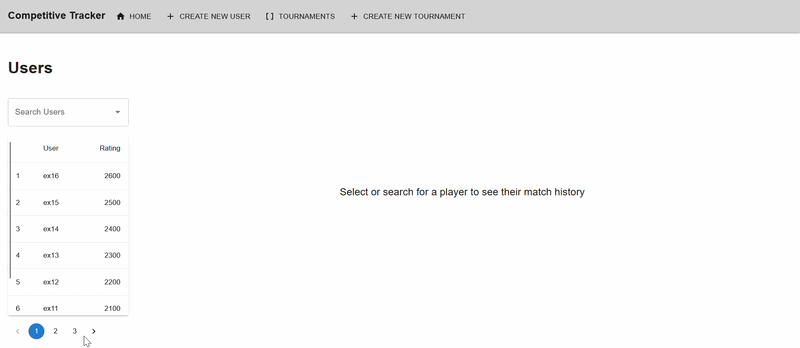
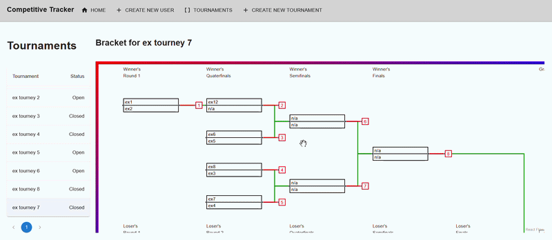

# CompetitiveTracker
Application for storing and acessing data on players in competive games

Application aimed at adiminstrators for a competitive ecosystem

Features
- Store information on players, including match history
- Enroll players in tournaments, and automatically build a seeded tournament with those players
- Tournaments can either be single or double elimination
- Decide the results of tournament matches

